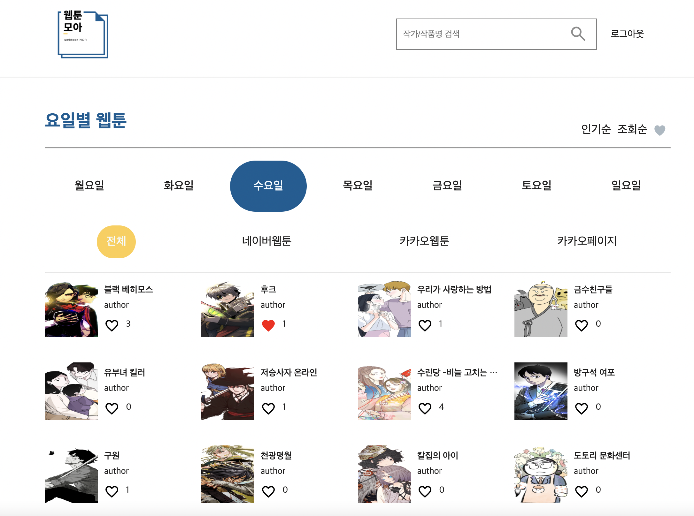
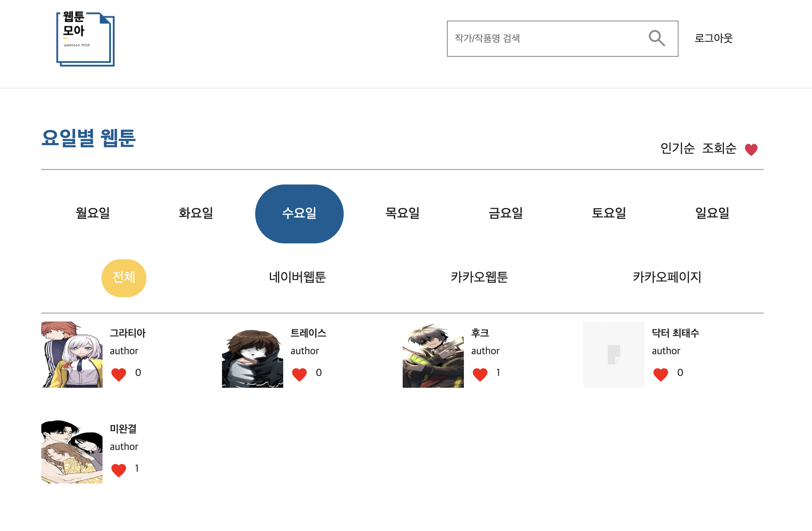
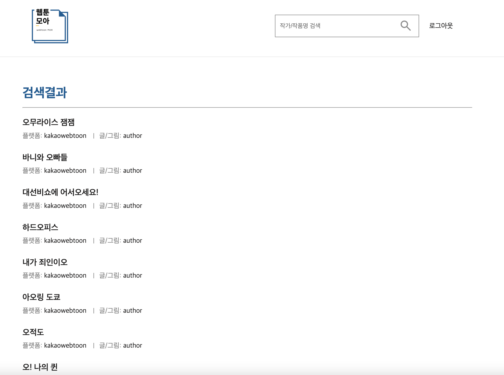
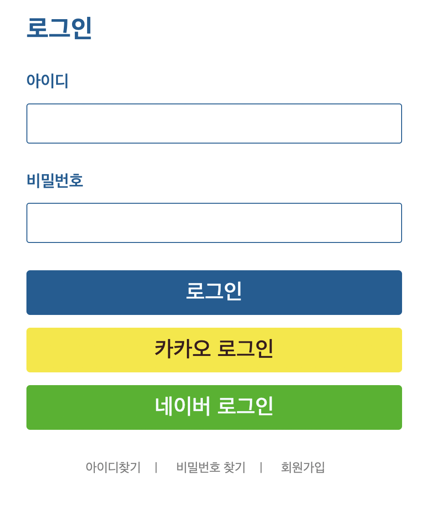
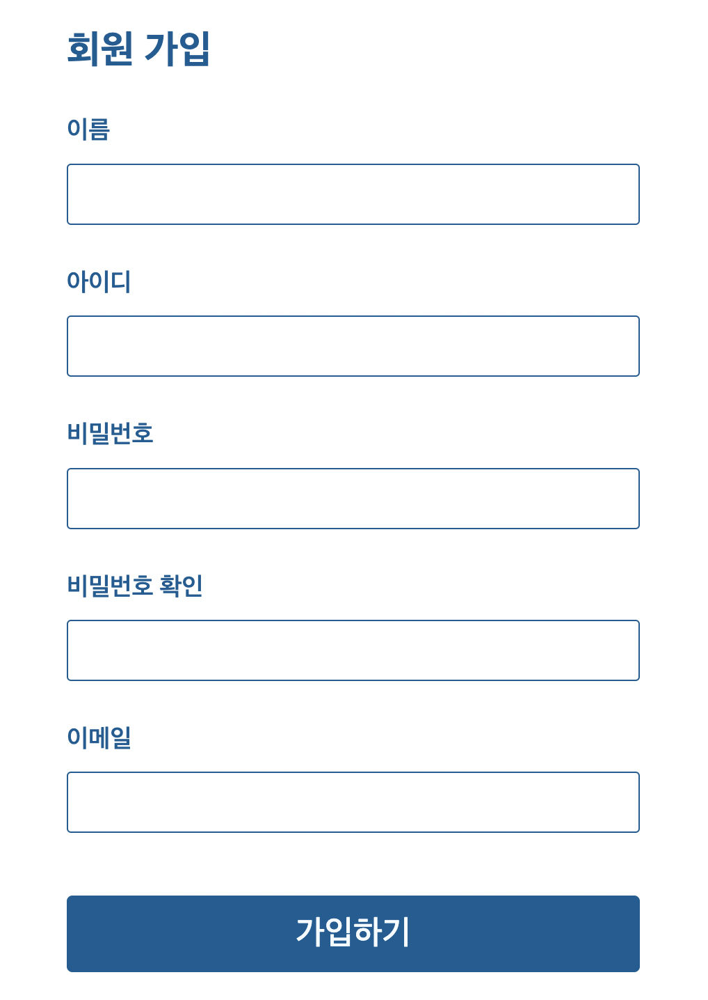
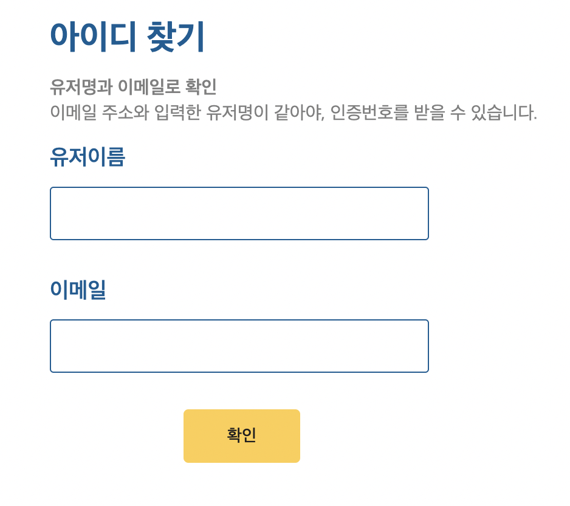
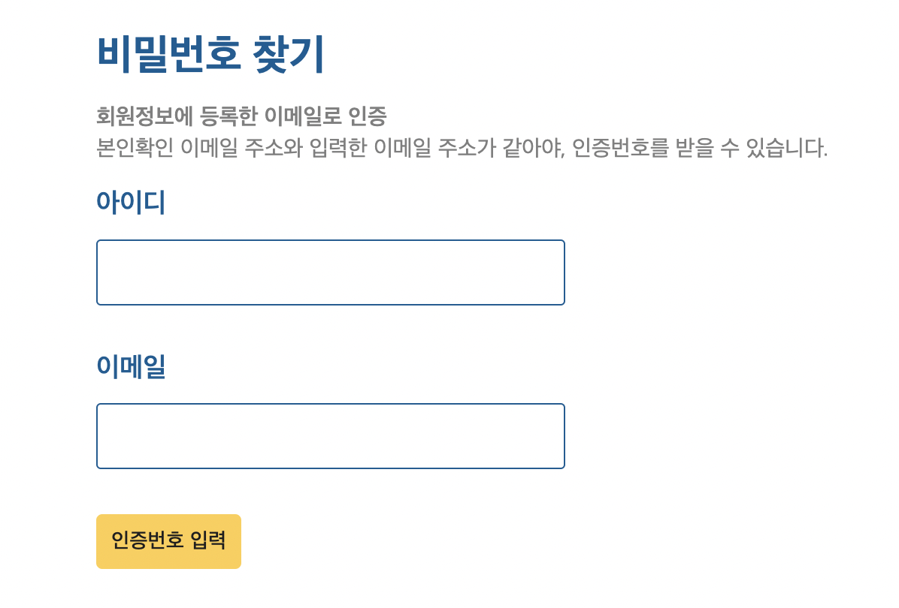
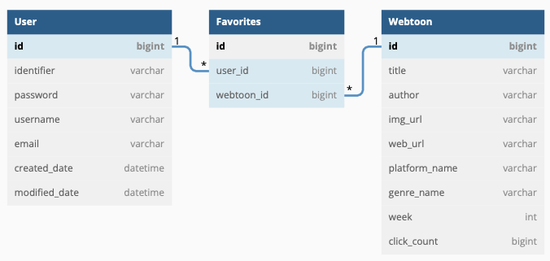

# 📚 Webtoon-Moa

## 🖥 사용자 인터페이스(UI)

### 메인 페이지

### 즐겨찾기 페이지

### 검색 페이지

### 로그인, 회원가입


### 아이디, 비밀번호 찾기



## ⚙️ 개발 환경(Development Environment)

| 분류 | 개발환경 | 
|---|---|
| 운영체제 | Windows 11 64bit / Mac OS |
| 개발도구 | Visual Studio Code, Postman, pm2 |
| 프레임워크 | Express.js 4.16.1 |
| 데이터베이스 | MySQL (Release 8.0.29) |
| 버전 관리 | Github, Git |
| 오픈소스 및 외부 라이브러리 | 네이버 웹툰, 카카오 웹툰, 카카오 페이지 크롤링, [카카오, 네이버 로그인 API], nodemailer |


## 🛠 세부 기술 스택(Tech Stack)

### 백엔드(Back-end)
- **Node.js**
- **Express.js**
- **Javascript**

### 데이터베이스(Database)

- **MySQL (Release 8.0.29)**

### 프론트엔드(Front-end)

- **HTML**
- **CSS**
- **JavaScript**
- **JQuery**
- **Ajax**

### ETC

- 추가 예정

## 📝 도메인 모델 분석(Domain Model Analysis)

### 회원(User)

- 회원과 웹툰의 관계 : 회원은 여러 개의 웹툰을 찜할 수 있다. 또한, 하나의 웹툰은 여러 명의 회원에 의해 찜해질 수 있다. (N:N)

### 웹툰(Webtoon)

- 웹툰과 회원의 관계 : 회원은 여러 개의 웹툰을 찜할 수 있다. 또한, 하나의 웹툰은 여러 명의 회원에 의해 찜해질 수 있다. (N:N)

## 📝 테이블 정의서(Entity Details)

### 회원(USER) 테이블

|컬럼명|한글명|TYPE|KEY|NOT NULL|
|:---:|:---:|:---:|:---:|:---:|
|USER_ID|회원 고유번호|BIGINT|PK|Y|
|IDENTIFIER|회원 아이디|VARCHAR||Y|
|PASSWORD|비밀번호|VARCHAR||Y|
|USERNAME|회원 이름|VARCHAR||Y|
|EMAIL|이메일|VARCHAR||Y|

### 즐겨찾기(FAVORITES) 테이블 

|컬럼명|한글명|TYPE|KEY|NOT NULL|
|:---:|:---:|:---:|:---:|:---:|
|FAVORITES_ID|즐겨찾기 고유번호|BIGINT|PK|Y|
|USER_ID|회원 고유번호|BIGINT|FK|Y|
|WEBTOON_ID|웹툰 고유번호|BIGINT|FK|Y|

### 웹툰(WEBTOON) 테이블

|컬럼명|한글명|TYPE|KEY|NOT NULL|
|:---:|:---:|:---:|:---:|:---:|
|WEBTOON_ID|웹툰 고유번호|BIGINT|PK|Y|
|TITLE|웹툰 이름|VARCHAR||Y|
|AUTHOR|웹툰 작가이름|VARCHAR||Y|
|IMG_URL|웹툰 대표 이미지 URL|VARCHAR||Y|
|WEB_URL|원본 웹툰 상세 페이지|VARCHAR||Y|
|PLATFORM_NAME|플랫폼 이름|VARCHAR||Y|
|GENRE_NAME|장르 이름|VARCHAR||Y|
|WEEK|요일(1~7:월-일)|INT||Y|
|CLICK_COUNT|조회수|BIGINT||Y|

## 🔗 엔티티-관계 모델(Entity Relationship Diagram)



## ⚙️ 로컬 데이터베이스 세팅

1. MySQL 을 자신의 컴퓨터에 설치한다. 이 때, 로컬 패스워드는 11111111 로 설정한다.
2. 설치가 완료되었으면 Terminal(Mac OS) or CMD(Windows)에 들어가서 다음과 같이 작성한다.

```shell
mysql -u root -p
```

접속이 안된다면 내 컴퓨터의 mysql이 깔려있는 폴더의 bin 폴더로 이동해서 다시 시도해보자.

접속이 되면 처음에 설치할 때 입력했던 패스워드를 작성하면 접속이 완료된다.

3. 데이터베이스를 만든다.

```shell
CREATE DATABASE webtoon-moa;
```

4. 데이터베이스를 사용한다고 선언한다.

```shell
USE webtoon-moa;
```

5. src 파일에 있는 init.sql의 내용을 복사해서 붙여넣기 후 실행한다.
6.  프로젝트 파일(src)의 터미널 창에서 node.js 로 init.js 를 실행한다.

```shell
src % node init.js
```

## 📐 트러블 슈팅(Trouble Shooting)

- 추가 예정

## 시연 영상 
[영상링크](https://i.imgur.com/7wbelwe.mp4/)  
